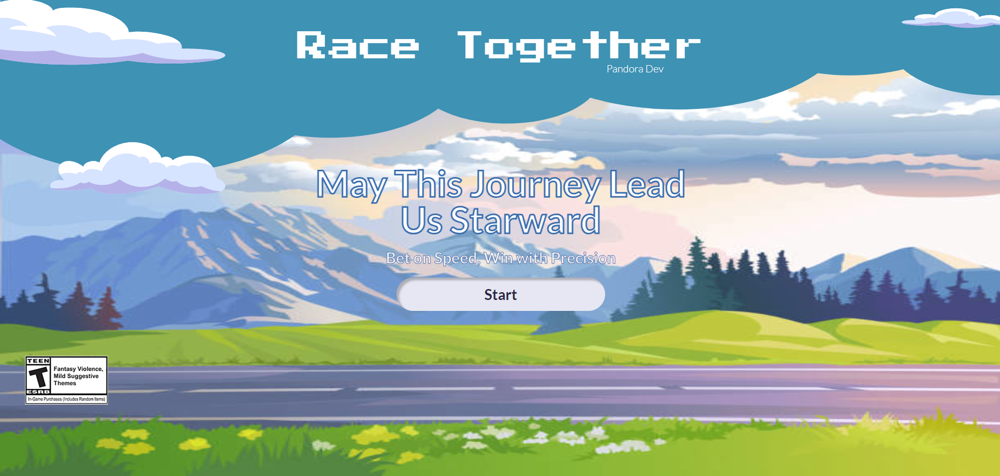

# Race-Together

# Giới thiệu

Đua xe là một thể loại trò chơi hấp dẫn và phổ biến, và chúng tôi muốn tạo ra một trải nghiệm mới mẻ bằng cách kết hợp yếu tố cá cược vào trong trò chơi.

## Mục tiêu

Phát triển một trò chơi đua xe trực tuyến độc đáo, kết hợp với việc đặt cược, mang lại trải nghiệm giải trí mới lạ và thú vị cho người chơi. Chúng tôi đặt ra mục tiêu tạo ra một môi trường chơi an toàn, hấp dẫn và dễ dàng quản lý trên nền tảng web.

## Công nghệ sử dụng

- IDE: Visual Studio Code
- Công nghệ: TailwindCss, ReactJs, ...
- Thư viện: Framer Motion, Howler.js,...
- Phần mềm quản lý dự án: Git, Github
- Design: Figma

## Môi trường phát triển

Node.js v18.18.2
